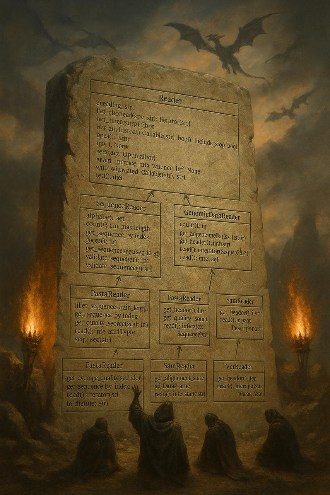

# BioFormat Tools




Проект для работы с основными биологическими форматами данных: FASTA, FASTQ, SAM, VCF.

## Возможности

- **FASTA**: чтение последовательностей, статистика
- **FASTQ**: анализ качества, построение графиков  
- **SAM**: работа с выравниваниями, фильтрация по регионам
- **VCF**: анализ геномных вариантов

---
## Установка (Python 3.9+)
```bash
git clone https://github.com/bioinf-rnrmu-stotoshka/bioformats-tourists
cd bioformats-tourists

python -m venv .venv
source .venv/bin/activate          # Windows: .venv\Scripts\activate
python -m pip install -U pip

# установить пакет (из pyproject.toml)
pip install -e .
# для разработки с тестами можно так:
# pip install -e .[dev]
```
---
## Быстрый пример (как библиотека)
```
from bioformats import FastaReader
with FastaReader("sample_data/example.fasta") as reader:
    for seq_id, sequence in reader.read():
        print(f"{seq_id}: {len(sequence)} bp")
```
---
## CLI (демонстрационные команды)
```
# FASTA статистика
bioformats fasta stats -i sample_data/example.fasta

# FASTQ QC: сохранит 3 PNG в ./reports
bioformats fastq qc -i sample_data/example.fastq -o reports

# SAM: сводка по хромосомам и срез по региону
bioformats sam chromstat -i sample_data/example.sam
bioformats sam slice -i sample_data/example.sam --chrom chr1 --start 100 --end 200

# VCF: сводка и срез
bioformats vcf chromstat -i sample_data/example.vcf
bioformats vcf slice -i sample_data/example.vcf --chrom chr1 --start 90 --end 150
```

## Документация

```
Полная документация доступна в папке docs/build/html/
```
## Команда


Все очень старались

 Лицензия
```
Проект распространяется под лицензией MIT.
См. LICENSE
 для подробностей.

```


